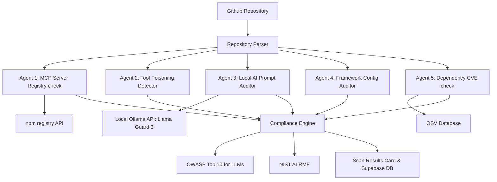

# Ward - MCP Auditor

Ward is an open-source, privacy-first security auditing platform built to identify supply chain threats, prompt injections, and security regressions inside Model Context Protocol (MCP) server stacks. 

Equipped with a local AI security agent powered by Llama Guard 3 or Granite Guardian running locally via Ollama, Ward scans GitHub repositories for malicious dependencies, CVE exploits, prompt hijack vectors, and compliance drift.

For details on database schemas and system integrations, see the [Technical Documentation](docs/TECHNICAL_DOCUMENTATION.md).

---

## Key Features

* Local AI Prompt Auditor: Evaluates system prompts and inline code blocks for semantic injection, jailbreaks, and instructions hijacking using local Ollama models with no API keys and zero cloud leakage.
* Supply Chain Integrity Check: Cross-references package declarations with the live npm registry, checking package age, solo-maintainer flags, and scanning for pre/post-install script vulnerabilities.
* Vulnerability Scanner (OSV Integration): Directly queries the OSV (Open Source Vulnerability) database to check dependencies against published CVE logs in real-time.
* Agent Agency Limits: Detects dangerous configurations in agent orchestrators (LangChain, LangGraph, CrewAI, AutoGen) such as excessive execution privileges or missing user verification steps.
* Security Compliance Mapping: Automatically tags scanner findings with OWASP Top 10 for LLMs (e.g., LLM01, LLM02) and the NIST AI Risk Management Framework (RMF).
* Repository Watchdog & Sync Policy: Watch GitHub repositories for commits, trigger automatic background scans, and manage global allowlists for authorized MCP servers.

---

## System Architecture


<p align="center">Figure 1: Ward Compliance System Architecture</p>

---

## Flow by Flow Explanation Detailed

The auditing execution flow runs in a sequence of automated stages:

1. Repository Tree Resolution: The user inputs a repository URL. Ward connects to the GitHub API, recursively walks the codebase file tree using the main branch references, and filters paths matching dependency manifests (package.json, requirements.txt) and prompt templates.
2. Parallel Agent Dispatch: Ward triggers 5 dedicated compliance agents concurrently:
    * Agent 1 parses server configurations (e.g., mcp.json) and triggers package info requests to the npm registry to detect solo owners, package ages, and pre/post-install scripts.
    * Agent 2 walks tool schemas in search of descriptive instructions, highlighting hidden tags or zero-width escape injections.
    * Agent 3 extracts system templates and sends them to the local Ollama API to run prompt jailbreak/hijacking classification.
    * Agent 4 checks python/typescript files to flag unsafe configurations like dangerouslyAllowCodeExecution set to true.
    * Agent 5 collects all package names and queries OSV database API endpoints in a batch to pull published CVEs.
3. Compliance Mapping: Raw signals from the agents are collected by the Compliance Engine. They are mapped to international frameworks (OWASP Top 10 for LLM Applications and NIST AI RMF).
4. Local LLM Judge Analysis: All gathered vulnerability signals are aggregated and evaluated by a local LLM Judge. The judge checks for false positives, assigns severity scores (Critical, High, Medium, Low), and writes a remediation summary.
5. Report Generation & DB Logging: The judge's verdicts are committed as PostgreSQL rows inside Supabase tables. A PDF report containing formatting details, severities, and compliance indices is compiled dynamically and stored in the client cache for download.

---

## Tech Stack

* Core: TanStack Start, React 19, TypeScript
* Styling: Tailwind CSS
* Database: Supabase Client (Authentication, Scans, and Watchlists)
* Local AI Agent: Ollama API (Llama Guard 3, Granite Guardian, Llama 3)
* Vulnerability Registry: OSV (Open Source Vulnerabilities) API

---

## Detailed Setup Steps

### 1. Clone the Repository
```bash
git clone https://github.com/ritvikindupuri/Ward---MCP-Auditior.git
cd Ward-MCP-Auditor
```

### 2. Install Dependencies
```bash
npm install
```

### 3. Setup Local AI (Ollama)
Ensure Ollama is running locally. Ward has automatic model discovery and will detect whatever model is running on your machine.

To download your preferred model:
```bash
# Pull the default security classifier model (Meta Llama Guard 3)
ollama pull llama-guard3

# Or pull any other general/security models you wish to use:
ollama pull granite-guardian:8b
ollama pull llama3
ollama pull mistral
ollama pull gemma
```
*Note: If multiple models are installed, the auditor automatically selects the best available security/chat model, falling back to the first available model in your Ollama library.*

### 4. Configure Environment Variables
Create a .env file in the root folder:
```env
# Supabase Configuration
SUPABASE_URL="https://your-supabase-project.supabase.co"
SUPABASE_PUBLISHABLE_KEY="your-publishable-key"
SUPABASE_SERVICE_ROLE_KEY="your-service-role-key"

# Ollama Model Override (Optional)
# If you want to force the scanner/chat to use a specific model:
AUDIT_AI_MODEL="mistral"  # e.g., "gemma", "llama3", or "llama-guard3"
```

### 5. Launch the Application
```bash
npm run dev
```
Open http://localhost:8080 in your browser.

---

## How to Use Ward

### 1. Connect GitHub (Dashboard)
1. Go to the Dashboard and click Connect GitHub.
2. Generate a fine-grained Personal Access Token (PAT) with read-only permissions for Contents and Metadata.
3. Paste the token to authorize read-only codebase parsing.

### 2. Dispatches Scans
1. Click New Scan in the top right corner.
2. Select any repository from the picker.
3. Click Scan. This spins up the 5 security agents in parallel. The active state will appear in the dashboard.

### 3. Review Findings & Compliance Maps
1. Once the scan is complete, click View Details to load the compliance dashboard.
2. Filter the report by agent categories (MCP, Tool Poisoning, Prompt Injection, Config, CVEs).
3. Expand any finding card to view the technical evidence, severity ratings, and automated OWASP Top 10 for LLM and NIST AI RMF compliance tags.

### 4. Chat with the Local AI Auditor
1. Navigate to the Chat with AI Auditor tab in the scan details drawer.
2. Type in any questions regarding the findings (e.g. "Why is dangerouslyAllowCodeExecution flagged?" or "Give me a code patch to fix this prompt injection").
3. The assistant will analyze the findings context and query your local Ollama LLM to output custom remediation instructions.

### 5. Clear or Reload Active Sessions
1. Click Clear Session on the dashboard card to hide the current scan and reset your workspace.
2. Clear actions do not delete the logs. Head over to the History tab to view your complete database history and click on any past scan to reload the session instantly.

### 6. Enforce Security Policies
1. Click the Policy tab in the sidebar console.
2. Enforce hard rules such as:
   * Blocking stdio servers initialized via npx (RCE-on-connect prevention).
   * Restricting server URLs to TLS connections.
   * Mandating pinned dependency versions.
3. Define strict custom Allow-lists and Deny-lists for approved MCP packages.

### 7. Monitor Codebases with Watchlists
1. Navigate to the Watchlist tab in the sidebar.
2. Add critical repositories and choose a scan cadence (e.g., scan every 24 hours).
3. Ward will automatically run periodic audits in the background whenever the console is open.

### 8. Download PDF Reports
1. In the scan details drawer, click Download PDF Report.
2. This generates a board-ready compliance report mapping every vulnerability to risk mitigation tasks.
