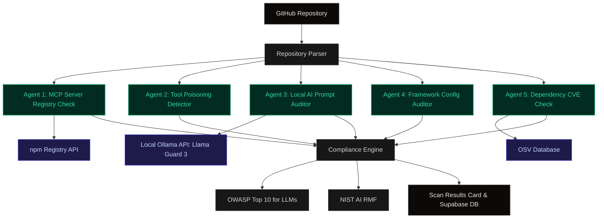

# Ward - MCP Auditor

Ward is an open-source, privacy-first security auditing platform built to identify supply chain threats, prompt injections, and security regressions inside Model Context Protocol (MCP) server stacks. 

Equipped with a local AI security agent powered by Llama Guard 3 or Granite Guardian running locally via Ollama, Ward scans GitHub repositories for malicious dependencies, CVE exploits, prompt hijack vectors, and compliance drift.

For details on database schemas and system integrations, see the [Technical Documentation](docs/TECHNICAL_DOCUMENTATION.md).

---

## Key Features

### 1. Local AI Prompt Auditor
Evaluates system prompts, templates, and inline code blocks for semantic injection, jailbreaks, and instructions hijacking. All evaluations are performed strictly using local Ollama models (such as `llama-guard3`, `granite-guardian:8b`, or `llama3`) running locally. This ensures no API keys are required and zero proprietary code is leaked to cloud services. It statically flags `<IMPORTANT>` tag insertions, zero-width characters, credential echo requests, data exfiltration lures, and executes an LLM judge on inline variables like `SYSTEM_PROMPT`.

### 2. Supply Chain Integrity Check (Agent 1)
Cross-references package declarations (such as those from `mcp.json`, `package.json`, or `.vscode/mcp.json`) with the live npm registry API. Specifically, it parses `stdio` configurations invoking remote packages (e.g. `npx`, `bunx`, `uvx`) to flag Remote Code Execution (RCE) on connect risks. It checks packages for:
* **Pre/Post-Install Scripts:** Flags packages running lifecycle scripts (common vector for malware).
* **Package Age:** Flags newly published dependencies (younger than 30 days by default), a known indicator of supply-chain attacks.
* **Maintainer Count:** Flags single-maintainer packages which carry higher compromise risks.

### 3. Vulnerability Scanner (OSV Integration)
Recursively parses `package.json` and `requirements.txt` manifests filtering for AI-centric dependencies (e.g., `langchain`, `openai`, `@modelcontextprotocol`, `crewai`, `transformers`). It batches these package versions and directly queries the OSV (Open Source Vulnerability) database API in real-time, mapping returned Common Vulnerability Scoring System (CVSS) scores directly to Critical, High, Medium, or Low severities.

### 4. Agent Framework Config Auditor
Deep-scans AI orchestrator configurations (LangChain, LangGraph, CrewAI, AutoGen, Vercel AI SDK) for dangerously insecure properties. This includes statically identifying variables such as `dangerously_allow_code_execution` set to true, using `PythonREPLTool` without a sandbox, unbounded maximum iterations (`max_iterations = None`), disabled human approval gates for mutating tools (e.g. `needsApproval: false`), or wildcard tool exposures (`allowed_tools: ["*"]`).

### 5. Security Compliance Mapping
Automatically tags raw scanner findings with recognized international frameworks:
* **OWASP Top 10 for LLM Applications 2025:** Mapped to LLM01 (Prompt Injection), LLM02 (Data Leakage), LLM03 (Supply Chain Vulnerabilities), and LLM06 (Excessive Agency).
* **NIST AI Risk Management Framework (RMF) 1.0:** Mapped to MAP-4.1, MEASURE-2.6, MEASURE-2.7, GOVERN-1.1, and MANAGE-2.3 based on deterministic rule associations.

### 6. Declarative Policy Engine & Repository Watchdog
Enforces organizational security constraints. Blocks `http://` transport schemas in favor of TLS, completely restricts `stdio` via `npx`, manages global `allowed_servers` (allowlist) or `denied_servers` (denylist). Background watchdog sync watches GitHub repositories for commits and triggers automatic background scans using the defined cadence (e.g. every 24 hours).

---

## System Architecture


<p align="center">Figure 1: Ward Compliance System Architecture</p>

---

## Execution Workflow

The auditing execution flow runs in a sequence of automated, deterministic, and highly parallelized stages:

1. **Repository Tree Resolution:** The user inputs a GitHub repository URL or selects one. Ward connects to the GitHub API via a PAT, recursively walks the codebase file tree (ignoring `node_modules`, `dist`, `build`, etc.) on the default branch. It specifically looks up manifest files (`mcp.json`, `package.json`, `requirements.txt`, etc.), agent orchestrator code (`.ts`, `.py`), and prompt files (`.prompt`, `system.md`).
2. **Parallel Agent Dispatch:** Ward triggers 5 dedicated compliance agents concurrently:
    * **Agent 1 (MCP Server Scanner):** Parses MCP config servers for `stdio` or `http` transport. Resolves the remote packages and calls the npm registry metadata API. Detects `npx` RCE-on-connect risks, identifies plaintext `http://` connections, and checks package metadata for `install` scripts, age under minimum days, and single-maintainer risks. Applies declarative org policies (allowlists/denylists).
    * **Agent 2 (Tool Poisoning Detector):** Reads code files defining tools (`defineTool`, `createTool`) scanning for description schemas. Executes regex heuristical checks to find hidden instructions like `<IMPORTANT>` tags, zero-width characters (bypassing filters), credential echo lures, or base64 data exfiltration blocks.
    * **Agent 3 (Local AI Prompt Auditor):** Extracts committed prompt files and inline prompt templates (e.g., `SYSTEM_PROMPT`). Checks them statically for role-override attempts. For inline variables, sends up to 12 extracted code snippets to a local LLM Judge via Ollama to dynamically evaluate prompt injection vulnerabilities.
    * **Agent 4 (Framework Config Auditor):** Inspects the orchestrator setups (Vercel AI SDK, Langchain, CrewAI). Scans for risky properties such as `dangerouslyAllowCodeExecution`, unbounded max iterations, wildcard `["*"]` tool exposure, and unsandboxed `PythonREPLTool` or `ShellTool`.
    * **Agent 5 (Dependency CVE Check):** Aggregates discovered package dependencies (filtering for the AI ecosystem), dedupes them, and batches them into a single HTTP POST request to the `api.osv.dev/v1/querybatch` endpoint. Re-maps CVSS scores to standardized severities.
3. **Compliance Mapping:** Raw signals from the parallel execution trace are normalized. Findings are systematically tagged with the `OWASP Top 10 for LLMs` and `NIST AI RMF 1.0` frameworks using a static, deterministic map.
4. **Local LLM Judge Arbitration:** For specific nuances (like inline prompt evaluation), the local LLM evaluates the evidence block to filter false positives and produce a human-readable, technically accurate reasoning string explaining the potential blast radius.
5. **Report Generation & DB Logging:** Findings are securely stored inside Supabase Postgres tables (`scans` and `findings`). A comprehensive, CISO-ready PDF report is compiled locally using `pdf-lib` detailing severities, coverage counts, and individual compliance tags.

---

## Tech Stack

* Core: TanStack Start, React 19, TypeScript
* Styling: Tailwind CSS
* Database: Supabase Client (Authentication, Scans, and Watchlists)
* Local AI Agent: Ollama API (Llama Guard 3, Granite Guardian, Llama 3)
* Vulnerability Registry: OSV (Open Source Vulnerabilities) API

---

## Setup Guide

### 1. Clone the Repository
```bash
git clone https://github.com/ritvikindupuri/Ward---MCP-Auditior.git
cd Ward-MCP-Auditor
```

### 2. Install Dependencies
```bash
npm install
```

### 3. Setup Local AI (Ollama)
Ensure Ollama is running locally. Ward has automatic model discovery and will detect whatever model is running on your machine.

To download your preferred model:
```bash
# Pull the default security classifier model (Meta Llama Guard 3)
ollama pull llama-guard3

# Or pull any other general/security models you wish to use:
ollama pull granite-guardian:8b
ollama pull llama3
ollama pull mistral
ollama pull gemma
```
*Note: If multiple models are installed, the auditor automatically selects the best available security/chat model, falling back to the first available model in your Ollama library.*

### 4. Configure Environment Variables
Create a .env file in the root folder:
```env
# Supabase Configuration
SUPABASE_URL="https://your-supabase-project.supabase.co"
SUPABASE_PUBLISHABLE_KEY="your-publishable-key"
SUPABASE_SERVICE_ROLE_KEY="your-service-role-key"

# Ollama Model Override (Optional)
# If you want to force the scanner/chat to use a specific model:
AUDIT_AI_MODEL="mistral"  # e.g., "gemma", "llama3", or "llama-guard3"
```

### 5. Launch the Application
```bash
npm run dev
```
Open http://localhost:8080 in your browser.

---

## How to Use Ward

### 1. Connect GitHub (Dashboard)
1. Go to the Dashboard and click Connect GitHub.
2. Generate a fine-grained Personal Access Token (PAT) with read-only permissions for Contents and Metadata.
3. Paste the token to authorize read-only codebase parsing.

### 2. Dispatches Scans
1. Click New Scan in the top right corner.
2. Select any repository from the picker.
3. Click Scan. This spins up the 5 security agents in parallel. The active state will appear in the dashboard.

### 3. Review Findings & Compliance Maps
1. Once the scan is complete, click View Details to load the compliance dashboard.
2. Filter the report by agent categories (MCP, Tool Poisoning, Prompt Injection, Config, CVEs).
3. Expand any finding card to view the technical evidence, severity ratings, and automated OWASP Top 10 for LLM and NIST AI RMF compliance tags.

### 4. Chat with the Local AI Auditor
1. Navigate to the Chat with AI Auditor tab in the scan details drawer.
2. Type in any questions regarding the findings (e.g. "Why is dangerouslyAllowCodeExecution flagged?" or "Give me a code patch to fix this prompt injection").
3. The assistant will analyze the findings context and query your local Ollama LLM to output custom remediation instructions.

### 5. Clear or Reload Active Sessions
1. Click Clear Session on the dashboard card to hide the current scan and reset your workspace.
2. Clear actions do not delete the logs. Head over to the History tab to view your complete database history and click on any past scan to reload the session instantly.

### 6. Enforce Security Policies
1. Click the Policy tab in the sidebar console.
2. Enforce hard rules such as:
   * Blocking stdio servers initialized via npx (RCE-on-connect prevention).
   * Restricting server URLs to TLS connections.
   * Mandating pinned dependency versions.
3. Define strict custom Allow-lists and Deny-lists for approved MCP packages.

### 7. Monitor Codebases with Watchlists
1. Navigate to the Watchlist tab in the sidebar.
2. Add critical repositories and choose a scan cadence (e.g., scan every 24 hours).
3. Ward will automatically run periodic audits in the background whenever the console is open.

### 8. Download PDF Reports
1. In the scan details drawer, click Download PDF Report.
2. This generates a board-ready compliance report mapping every vulnerability to risk mitigation tasks.
