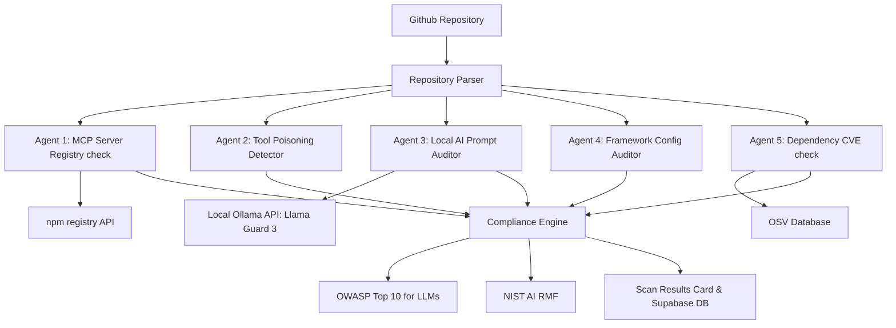

# 🛡️ Ward — Open-Source Local AI Security Auditor for MCP Stacks

**Ward** is an advanced, privacy-first security auditing platform built to identify supply chain threats, prompt injections, and security regressions inside **Model Context Protocol (MCP) server stacks**. 

Equipped with a local AI security agent powered by **Llama Guard 3 / Granite Guardian** (via Ollama), Ward scans GitHub repositories for malicious dependencies, CVE exploits, prompt hijack vectors, and compliance drift.

---

## 🚀 Key Features

* **🛡️ Local AI Prompt Auditor**: Evaluates system prompts and inline code blocks for semantic injection, jailbreaks, and instructions hijacking using local Ollama models (no API keys, zero cloud leakage).
* **📦 Supply Chain Integrity Check**: Cross-references package declarations with the live npm registry, checking package age, solo-maintainer flags, and scanning for pre/post-install script vulnerabilities.
* **🔍 Vulnerability Scanner (OSV Integration)**: Directly queries the OSV (Open Source Vulnerability) database to check dependencies against published CVE logs in real-time.
* **🧱 Agent Agency Limits**: Detects dangerous configurations in agent orchestrators (LangChain, LangGraph, CrewAI, AutoGen) such as excessive execution privileges or missing user verification steps.
* **📋 Security Compliance Mapping**: Automatically tags scanner findings with **OWASP Top 10 for LLMs** (e.g., LLM01, LLM02) and the **NIST AI Risk Management Framework (RMF)**.
* **🔄 Repository Watchdog & Sync Policy**: Watch GitHub repositories for commits, trigger automatic background scans, and manage global allowlists for authorized MCP servers.

---

## 🛠️ Technology Stack

* **Core**: TanStack Start, React 19, TypeScript
* **Styling**: Tailwind CSS
* **Database**: Supabase client (auth, scans, and watched repositories)
* **Local AI Agent**: Ollama API (`llama-guard3` / `granite-guardian` / `llama3`)
* **Vulnerability Source**: Open Source Vulnerability (OSV) API

---

## 📦 Installation & Setup

### 1. Clone the repository
```bash
git clone https://github.com/ritvikindupuri/Ward-MCP-Auditor.git
cd Ward-MCP-Auditor
```

### 2. Install dependencies
```bash
npm install
```

### 3. Setup Local AI (Ollama)
Ensure Ollama is running locally. Ward has **automatic model discovery** and will detect whatever model is running on your machine. 

To download your preferred model:
```bash
# Pull the default security classifier model (Meta Llama Guard 3)
ollama pull llama-guard3

# Or pull any other general/security models you wish to use:
ollama pull granite-guardian:8b
ollama pull llama3
ollama pull mistral
ollama pull gemma
```
*Note: If multiple models are installed, the auditor automatically selects the best available security/chat model, falling back to the first available model in your Ollama library.*

### 4. Configure Environment Variables
Create a `.env` file in the root folder:
```env
# Supabase Configuration
SUPABASE_URL="https://your-supabase-project.supabase.co"
SUPABASE_PUBLISHABLE_KEY="your-publishable-key"
SUPABASE_SERVICE_ROLE_KEY="your-service-role-key"

# Ollama Model Override (Optional)
# If you want to force the scanner/chat to use a specific model:
AUDIT_AI_MODEL="mistral"  # e.g., "gemma", "llama3", or "llama-guard3"
```

### 5. Launch the Application
```bash
npm run dev
```
Open **`http://localhost:8080`** in your browser.

---

## 📐 Architecture & Compliance Pipeline



---

## 🤝 Change Governance

Ward maps findings directly to security frameworks:
* **LLM01 / MEASURE-2.7**: Prompt injection & jailbreak risks.
* **LLM03 / MAP-4.1**: Supply chain risks (recently published packages, solo maintainers, install script exploits).
* **LLM06 / MANAGE-2.3**: Excessive agency & execution parameters.

---

## 🔒 Privacy & Safety Statement
Ward is designed with a **privacy-first data boundary**. All code prompts, metadata, and tool configuration scans are evaluated by the **local Ollama instance** running directly on your CPU/GPU. No code, schema parameters, or private agent definitions are ever transmitted to third-party cloud APIs.
