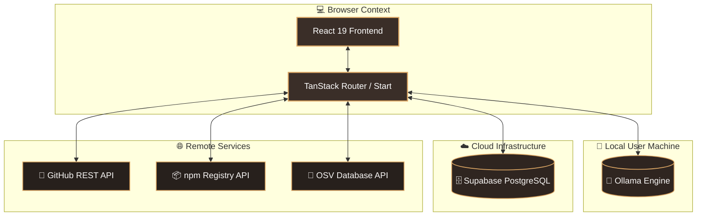
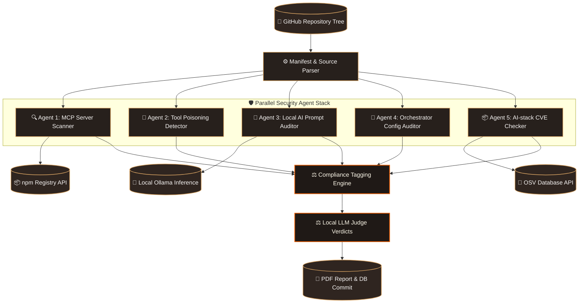

# Technical Documentation - Ward MCP Auditor

**By: Ritvik Indupuri**  
**Date: Jul 3, 2026**

This document provides a comprehensive technical breakdown of the architecture, data flows, compliance mapping pipelines, and component models of Ward, an open-source local security auditing platform for Model Context Protocol (MCP) server environments.

---

## Table of Contents
1. [Executive Summary](#executive-summary)
2. [System Architecture](#system-architecture)
3. [Agent Architecture](#agent-architecture)
4. [Core Features](#core-features)
5. [Database Tables Schema](#database-tables-schema)
6. [Compliance Standards Mapping](#compliance-standards-mapping)
7. [Conclusion](#conclusion)

---

## Executive Summary

As artificial intelligence agents and orchestrators gain autonomous capabilities to invoke tools and read dynamic inputs via the Model Context Protocol (MCP), they introduce a broad and highly vulnerable attack surface. These risks range from remote code execution (RCE-on-connect) through unverified server configurations, to prompt injection, supply chain poisoning, and data exfiltration.

Ward is designed to provide security teams with a privacy-first, local compliance and auditing framework to scan, evaluate, and map these vulnerabilities. By integrating static code analysis, registry dependency lookups, and local LLM-based prompt classification, Ward enables companies to audit their AI agent stacks without sending proprietary source code or system configurations to third-party cloud APIs. All evaluations and conversational remediation chats occur entirely within a secure local data boundary.

---

## System Architecture

Ward operates as a client-server web application using a local-first analysis model. The React-based frontend communicates with background agents to orchestrate checks, fetch repository trees, and query registry APIs.


<p align="center">Figure 1: Ward System Integration and Client-Server Boundary Architecture</p>

The System Architecture divides operations into three primary boundaries:
1. Browser Client: Initiates scans, manages active session states, renders compliance findings cards, and executes local-first AI chats.
2. Local User Machine: Runs the Ollama server for LLM inference (prompt evaluations and interactive remediation chat) and hosts the developer's development server.
3. Cloud and Remote Services: Connects to Supabase to authorize sessions and store scans/findings logs, maps repositories via the GitHub REST API, and queries npm and OSV APIs for live package intelligence.

---

## Agent Architecture

When an audit is triggered, Ward dispatches a pipeline of five specialized, parallel security agents that parse the repository and feed raw signals into a centralized Compliance Engine.


<p align="center">Figure 2: Multi-Agent Analysis and Compliance Evaluation Pipeline</p>

The evaluation workflow flows through the following checkpoints:

1. **Repository File Parsing:** Ward connects via PAT to the GitHub API, calling `/git/trees/{branch}?recursive=1` to pull the file structure instantly. It skips common binary/build directories (like `node_modules`, `dist/`, `.venv/`) and filters specifically for manifest files (`mcp.json`, `cursor.json`, `claude_desktop_config.json`, `package.json`, `smithery.yaml`, `requirements.txt`) as well as source code orchestrator scripts and prompt templates (`.md`, `.txt`, `.yaml`, `.json`).
2. **Agent Ingestion (Parallel Dispatch):** The five security agents execute parallel evaluations:
    * **Agent 1 (MCP Server Scanner):** Parses `mcpServers` object configurations. Determines transport layer protocols (`stdio` vs `http`). It explicitly looks at the `command` (like `npx`, `uvx`, `bunx`) to extract the remote target package. It then fetches `https://registry.npmjs.org/` to assert conditions like whether the latest version contains `install`, `preinstall`, or `postinstall` lifecycle scripts (RCE vectors). It also compares the package creation date against the allowed minimum age (e.g. 30 days) and flags packages with only 1 maintainer. Checks against the strict `allowList` and `denyList` policies loaded from Supabase are also applied here.
    * **Agent 2 (Tool Poisoning Detector):** Reads tool schema definitions, hunting for `<IMPORTANT>` hidden tag strings, base64 blobs, or data-exfiltration URLs masked in tool descriptions. Since AI models interpret tool descriptions as implicit system context, instructions injected here can seamlessly alter the AI’s objective. Uses exact static regex matches to guarantee deterministic captures.
    * **Agent 3 (Local AI Prompt Auditor):** Sweeps matching system prompt paths. Additionally uses regex to extract inline `SYSTEM_PROMPT`, `system_message`, and `PromptTemplate` literal strings from `.ts` and `.py` source files. Compiles up to 12 of these inline extracts and dynamically sends them to the local `http://localhost:11434/api/generate` Ollama endpoint in `json` mode format. The model classifies whether any text contains credential-echo requests or semantic jailbreaks.
    * **Agent 4 (Framework Config Auditor):** Targets orchestration files involving Langchain, AI-SDK, CrewAI, etc. Flags dangerous literals like `dangerously_allow_code_execution = true`, `max_iterations = None`, missing `needsApproval` human gates for mutating tool definitions, and unconstrained wildcard tool availability (`allowed_tools: ["*"]`).
    * **Agent 5 (AI-stack CVE Checker):** Extracts package names and versions from `package.json` and `requirements.txt`. Filters these against an `AI_STACK_RX` regex (e.g., `langchain`, `openai`, `@modelcontextprotocol`, `crewai`, etc.). Makes a bulk POST query to `api.osv.dev/v1/querybatch`, parsing any reported Common Vulnerabilities and Exposures (CVEs) and aligning the numerical CVSS scores into severity brackets (Critical, High, Medium, Low).
3. **Normalization (Compliance Engine):** The deterministic mapping logic (`COMPLIANCE_MAP`) standardizes these findings. Every finding natively receives an OWASP LLM Top 10 code (e.g. LLM01, LLM03, LLM06) and a NIST AI RMF tag (e.g., MAP-4.1, MEASURE-2.7, GOVERN-1.1, MANAGE-2.3).
4. **Judge Arbitration:** Specific dynamic verdicts (like severity downgrades or rationales for inline code snippets) are managed by the LLM response formatting. The Judge sets `judge_verdict` (`confirmed`, `likely`, `needs-review`) and provides concise string explanations into `judge_reasoning`.
5. **Report Export:** Aggregated results, metadata, and progress logs are UPSERTED to Supabase Postgres rows. An automated, layout-perfect PDF document is compiled inside the node environment using `pdf-lib` and returned as a Base64 blob to the client for download.

---

## Core Features

### GitHub Integration & Repository Walks
Ward connects to GitHub using fine-grained Personal Access Tokens (PAT). It recursively walks repo directory trees utilizing the `/git/trees` endpoint with `recursive=1`. It parses manifest declarations and source code files dynamically without the heavy overhead of cloning the entire repository, filtering out noisy paths like `node_modules` or `dist/`.

### Multi-Agent Pipeline & Dependency Audits
Runs static, deeply-inspective scans in 5 parallel pipelines:
1. **Agent 1 (MCP):** Extracts `mcp.json`, `claude_desktop_config.json`, or `smithery.yaml`. Inspects `stdio` vs `http` transports. Parses `npx/uvx` executions and queries the npm API to flag pre/post-install lifecycle scripts, verify package age limits (e.g. <30 days), and maintainer concentration (solo maintainers). Enforces allowlist/denylist policies.
2. **Agent 2 (Tool Poisoning):** Targets JSON and Typescript/Python files matching tool definitions. Utilizes heuristic regexes to uncover prompt smuggling vectors inside tool descriptions—such as hidden `<IMPORTANT>` blocks, zero-width characters `[\u200B-\u200D\uFEFF]`, system role impersonations, credential echoing targets, and URL exfiltration patterns.
3. **Agent 3 (Prompt Injection):** Parses all committed prompt templates (`.prompt`, `system.md`). Additionally, it pulls inline strings bound to `SYSTEM_PROMPT` or `ChatPromptTemplate` in `.ts/.py` files and orchestrates a local LLM judge strictly to evaluate the payload for role-override strings, bypassing instructions, or jailbreaks.
4. **Agent 4 (Framework Config):** Specifically looks for misconfigured attributes in AI agents. Flags settings such as `dangerously_allow_code_execution = true`, unbounded `max_iterations`, the use of `PythonREPLTool` without restricted scopes, missing `needsApproval` steps for mutating tool calls, and wildcard tool permissions `["*"]`.
5. **Agent 5 (AI-stack CVEs):** Parses `package.json` and `requirements.txt`. Filters strictly by AI-stack packages (e.g., `@langchain/`, `openai`, `@modelcontextprotocol/`, `crewai`, etc.). Makes a bulk POST query to `api.osv.dev/v1/querybatch` to map explicit versions to known CVE advisories, parsing CVSS scores into discrete severities (CVSS > 9 is Critical).

### Local AI Prompt Auditing
Utilizes Ollama to scan system prompts and templates natively. The system dynamically polls `http://localhost:11434/api/tags` for active models (prioritizing `granite-guardian:8b`, `llama-guard3`, or falling back to `llama3`). It queries Ollama in JSON mode for structured `{ risks: [...] }` output. Because inference occurs locally, proprietary prompts never leak over cloud networks.

### Declarative Policy Management
A strict configuration engine enabling organizational governance. Through the Supabase `mcp_policies` table, teams can enforce hard rules such as:
- Blocking execution of `stdio` servers via `npx` (to prevent RCE-on-connect supply chain risks).
- Blocking HTTP transport schemas to mandate TLS transmission of tool arguments.
- Enforcing minimum package age days (e.g., 30 days) to mitigate recently-published malware.
- Mandating explicitly approved servers (`allowed_servers` list) or blocking malicious ones (`denied_servers` list).

### Periodic Background Watchlists
Monitors watched codebases actively. The UI polls the `listDueRescans` function, which calculates elapsed time against user-configured hourly cadences (e.g., 24 hours). The frontend automatically triggers `startScan` in the background for any stale repos as long as the console is open, ensuring continuous compliance.

### Decoupled Session Lifecycle & Real-Time Sync
Dashboard views display the current active scan mapping real-time progress fields (`mcp: running`, `tool-poison: done`). State is stored in Postgres jsonb columns. You can `Clear Session` on the UI without mutating the database—historical logs are permanently retained in the `scans` and `findings` tables for reload at any time.

### Automated PDF Reports
Dynamically creates compliant, board-ready PDF documents natively in the Node.js server function using `pdf-lib`. It groups identified vulnerabilities by the 5 agent types, maps them to the OWASP Top 10 for LLMs and NIST RMF standards, aggregates evidence snippets, provides the LLM Judge's reasoning, and visualizes posture severity breakdowns.

---

## Database Tables Schema

Ward utilizes Supabase for authentication and session logging:

### scans
Stores top-level metadata of scanned repositories.
```sql
CREATE TABLE scans (
  id UUID PRIMARY KEY DEFAULT gen_random_uuid(),
  user_id UUID REFERENCES auth.users(id),
  repo_full_name TEXT NOT NULL,
  repo_url TEXT NOT NULL,
  status TEXT NOT NULL, -- 'running', 'complete', 'failed'
  summary JSONB NOT NULL DEFAULT '{}'::jsonb,
  progress JSONB NOT NULL DEFAULT '{}'::jsonb,
  started_at TIMESTAMPTZ DEFAULT now(),
  completed_at TIMESTAMPTZ
);
```

### findings
Stores individual vulnerabilities identified by the scanner.
```sql
CREATE TABLE findings (
  id UUID PRIMARY KEY DEFAULT gen_random_uuid(),
  scan_id UUID REFERENCES scans(id) ON DELETE CASCADE,
  agent TEXT NOT NULL, -- 'mcp', 'tool-poison', 'prompt-injection', 'agent-config', 'ai-deps'
  severity TEXT NOT NULL, -- 'low', 'medium', 'high', 'critical'
  title TEXT NOT NULL,
  description TEXT NOT NULL,
  evidence JSONB NOT NULL DEFAULT '{}'::jsonb,
  judge_verdict TEXT NOT NULL, -- 'confirmed', 'likely', 'needs-review'
  judge_reasoning TEXT,
  compliance_key TEXT,
  policy_violation TEXT,
  created_at TIMESTAMPTZ DEFAULT now()
);
```

### watched_repos
Tracks repositories configured for automatic commit triggers.
```sql
CREATE TABLE watched_repos (
  id UUID PRIMARY KEY DEFAULT gen_random_uuid(),
  user_id UUID REFERENCES auth.users(id),
  repo_full_name TEXT NOT NULL,
  enabled BOOLEAN NOT NULL DEFAULT true,
  last_scanned_at TIMESTAMPTZ,
  last_scan_id UUID REFERENCES scans(id)
);
```

---

## Compliance Standards Mapping

Findings are mapped to international security standards in ward.functions.ts via the COMPLIANCE_MAP lookup:

| Vulnerability Type | OWASP Top 10 for LLMs | NIST AI Risk Management Framework (RMF) |
| :--- | :--- | :--- |
| **Prompt Injection** | LLM01 (Prompt Injection) | MEASURE-2.7 |
| **Sensitive Info Disclosure** | LLM02 (Data Leakage) | MEASURE-2.6 |
| **Supply Chain Risks** | LLM03 (Supply Chain Vulnerabilities) | MAP-4.1 |
| **Excessive Agency** | LLM06 (Excessive Agency) | MANAGE-2.3 |

---

## Conclusion

By combining deterministic checks with local AI inference, Ward provides a comprehensive and secure solution for auditing Model Context Protocol (MCP) environments. Its architecture ensures that organizations can identify vulnerabilities, enforce policies, and maintain compliance standards while keeping sensitive source code within their local network security boundaries.
