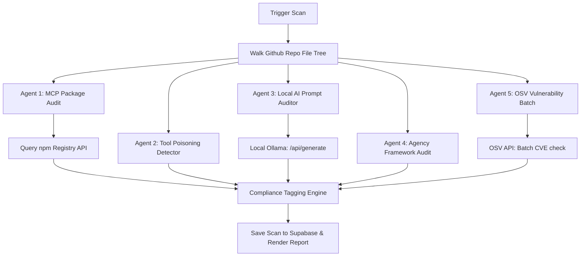

# Technical Documentation - Ward MCP Auditor

This document provides a detailed technical overview of Ward, an open-source security auditor for Model Context Protocol (MCP) server stacks.

---

## System Architecture

Ward operates as a static-and-dynamic compliance scanner running locally with remote database storage:

```
[ Frontend: React 19 / Tailwind ] <---> [ Routing: TanStack Router / Start ]
                                                    |
             +--------------------------------------+-------------------------------------+
             |                                      |                                     |
     [ Supabase DB API ]                     [ GitHub REST API ]                   [ Local Ollama API ]
  - User Profile & Auth                  - Repository Tree Walks              - Llama Guard 3 Classifier
  - Scan Results Logs                    - File Content Fetches               - Prompt Injection Audits
  - Repository Watches
```

---

## The Multi-Agent Compliance Pipeline

Ward runs 5 dedicated security check agents sequentially on the audited repository:



### 1. Agent 1: MCP Server Package Scanner
* Purpose: Identifies exposed MCP servers and checks their package health.
* Mechanism: Queries https://registry.npmjs.org/<package> to fetch metadata.
* Vulnerabilities Flagged: 
  * install_script: If package contains post-install scripts (highly prone to supply-chain execution worms).
  * young_package: If package age is below policy threshold (e.g. less than 30 days).
  * solo_maintainer: If package has only one owner (risk of account hijack).

### 2. Agent 2: Tool Poisoning Detector
* Purpose: Inspects tool schemas for descriptive prompt lures.
* Mechanism: Heuristic regex scanning targeting tool definition arguments (defineTool, createTool, tool()).

### 3. Agent 3: Local AI Prompt Auditor
* Purpose: Evaluates committed system prompts and inline template files for prompt injection vulnerabilities.
* Mechanism: Queries the local Ollama instance at http://localhost:11434/api/generate with "format": "json".
* Dynamic Model Selection:
  1. Reads process.env.AUDIT_AI_MODEL first if defined.
  2. Queries local Ollama /api/tags to check active models.
  3. Picks granite-guardian:8b, llama-guard3, or llama3 based on presence.
  4. Falls back gracefully to llama-guard3.
* Output Format:
  ```json
  {
    "risks": [
      {
        "file": "src/prompts/system.txt",
        "severity": "high",
        "issue": "Role override",
        "reasoning": "Prompt contains instructions enabling users to bypass default system instructions."
      }
    ]
  }
  ```

### 4. Agent 4: Agent Framework Config Auditor
* Purpose: Scans code files (.ts, .py, .js) for excessive agency parameters in orchestrators (LangChain, CrewAI, AutoGen, etc.).
* Vulnerabilities Flagged:
  * dangerous_exec: Presence of dangerouslyAllowHtml, dangerouslyAllowCodeExecution, or unverified execution hooks.

### 5. Agent 5: OSV Vulnerability Audit
* Purpose: Checks packages against the Open Source Vulnerabilities database.
* Mechanism: Sends a batch request containing dependencies to https://api.osv.dev/v1/query.

---

## Interactive AI Auditor Chat

Ward exposes a local-first AI Security Q&A Assistant inside the scan detail modal, enabling developers to ask follow-up questions about findings:

* Prompt Engineering: When a query is made, Ward aggregates all scan findings into a Markdown context list:
  ```markdown
  - [CRITICAL] dangerously_allow_code_execution enabled: Unsandboxed PythonREPLTool found...
  - [HIGH] committed system prompt injection: Role override risk...
  ```
  It compiles this into a system context:
  `You are the Ward Security AI Assistant. Explain these findings and provide remediation guides...`
* Local Inference Boundary: The chat queries your local Ollama port (localhost:11434/api/generate) directly from the browser context. Conversation logs, source codes, and vulnerability telemetry remain strictly inside the local network loop.
* General LLM Support: Ward resolves and utilizes general models like llama3, mistral, and gemma by checking pulled tags, defaulting to general models over safety classifiers for rich conversational guidance.

---

## Scan History & Session Lifecycle

The Console utilizes a decoupled state architecture to manage active sessions and persistent history logs:

* Active Session State: The main dashboard displays the latest scan session in state. When a user triggers Clear Session, the app resets the workspace view to a clean state but preserves all scan logs in the Supabase PostgreSQL database.
* Session Reloading: Selecting any record inside the History tab lifts the openScanId state, loading the complete findings list and AI Chat history for that historical scan instantly.
* History Purging: Developers can delete all historic scan logs via the Clear History button, which executes a Supabase query:
  ```sql
  DELETE FROM scans WHERE id != '00000000-0000-0000-0000-000000000000';
  ```

---

## Database Tables Schema

Ward utilizes Supabase for authentication and session logging:

### scans
Stores top-level metadata of scanned repositories.
```sql
CREATE TABLE scans (
  id UUID PRIMARY KEY DEFAULT gen_random_uuid(),
  user_id UUID REFERENCES auth.users(id),
  repo_full_name TEXT NOT NULL,
  repo_url TEXT NOT NULL,
  status TEXT NOT NULL, -- 'running', 'complete', 'failed'
  summary JSONB NOT NULL DEFAULT '{}'::jsonb,
  progress JSONB NOT NULL DEFAULT '{}'::jsonb,
  started_at TIMESTAMPTZ DEFAULT now(),
  completed_at TIMESTAMPTZ
);
```

### findings
Stores individual vulnerabilities identified by the scanner.
```sql
CREATE TABLE findings (
  id UUID PRIMARY KEY DEFAULT gen_random_uuid(),
  scan_id UUID REFERENCES scans(id) ON DELETE CASCADE,
  agent TEXT NOT NULL, -- 'mcp', 'tool-poison', 'prompt-injection', 'agent-config', 'ai-deps'
  severity TEXT NOT NULL, -- 'low', 'medium', 'high', 'critical'
  title TEXT NOT NULL,
  description TEXT NOT NULL,
  evidence JSONB NOT NULL DEFAULT '{}'::jsonb,
  judge_verdict TEXT NOT NULL, -- 'confirmed', 'likely', 'needs-review'
  judge_reasoning TEXT,
  compliance_key TEXT,
  policy_violation TEXT,
  created_at TIMESTAMPTZ DEFAULT now()
);
```

### watched_repos
Tracks repositories configured for automatic commit triggers.
```sql
CREATE TABLE watched_repos (
  id UUID PRIMARY KEY DEFAULT gen_random_uuid(),
  user_id UUID REFERENCES auth.users(id),
  repo_full_name TEXT NOT NULL,
  enabled BOOLEAN NOT NULL DEFAULT true,
  last_scanned_at TIMESTAMPTZ,
  last_scan_id UUID REFERENCES scans(id)
);
```

---

## Compliance Standards Mapping

Findings are mapped to international security standards in ward.functions.ts via the COMPLIANCE_MAP lookup:

| Vulnerability Type | OWASP Top 10 for LLMs | NIST AI Risk Management Framework (RMF) |
| :--- | :--- | :--- |
| **Prompt Injection** | LLM01 (Prompt Injection) | MEASURE-2.7 |
| **Sensitive Info Disclosure** | LLM02 (Data Leakage) | MEASURE-2.6 |
| **Supply Chain Risks** | LLM03 (Supply Chain Vulnerabilities) | MAP-4.1 |
| **Excessive Agency** | LLM06 (Excessive Agency) | MANAGE-2.3 |
