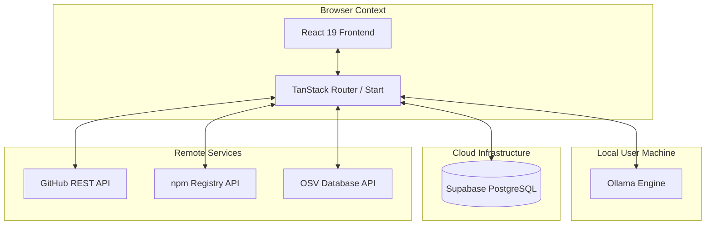
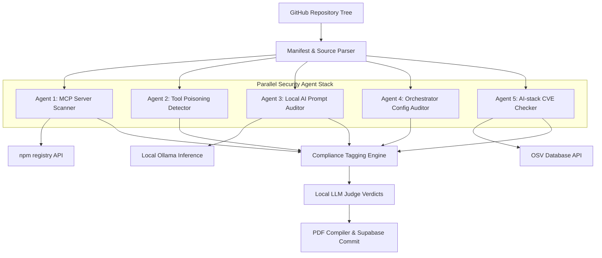

# Technical Documentation - Ward MCP Auditor

**By: Ritvik Indupuri**  
**Date: Jul 3, 2026**

This document provides a comprehensive technical breakdown of the architecture, data flows, compliance mapping pipelines, and component models of Ward, an open-source local security auditing platform for Model Context Protocol (MCP) server environments.

---

## Table of Contents
1. [Executive Summary](#executive-summary)
2. [System Architecture](#system-architecture)
3. [Agent Architecture](#agent-architecture)
4. [Core Features](#core-features)
5. [Database Tables Schema](#database-tables-schema)
6. [Compliance Standards Mapping](#compliance-standards-mapping)
7. [Conclusion](#conclusion)

---

## Executive Summary

As artificial intelligence agents and orchestrators gain autonomous capabilities to invoke tools and read dynamic inputs via the Model Context Protocol (MCP), they introduce a broad and highly vulnerable attack surface. These risks range from remote code execution (RCE-on-connect) through unverified server configurations, to prompt injection, supply chain poisoning, and data exfiltration.

Ward is designed to provide security teams with a privacy-first, local compliance and auditing framework to scan, evaluate, and map these vulnerabilities. By integrating static code analysis, registry dependency lookups, and local LLM-based prompt classification, Ward enables companies to audit their AI agent stacks without sending proprietary source code or system configurations to third-party cloud APIs. All evaluations and conversational remediation chats occur entirely within a secure local data boundary.

---

## System Architecture

Ward operates as a client-server web application using a local-first analysis model. The React-based frontend communicates with background agents to orchestrate checks, fetch repository trees, and query registry APIs.


<p align="center">Figure 1: Ward System Integration and Client-Server Boundary Architecture</p>

The System Architecture divides operations into three primary boundaries:
1. Browser Client: Initiates scans, manages active session states, renders compliance findings cards, and executes local-first AI chats.
2. Local User Machine: Runs the Ollama server for LLM inference (prompt evaluations and interactive remediation chat) and hosts the developer's development server.
3. Cloud and Remote Services: Connects to Supabase to authorize sessions and store scans/findings logs, maps repositories via the GitHub REST API, and queries npm and OSV APIs for live package intelligence.

---

## Agent Architecture

When an audit is triggered, Ward dispatches a pipeline of five specialized, parallel security agents that parse the repository and feed raw signals into a centralized Compliance Engine.


<p align="center">Figure 2: Multi-Agent Analysis and Compliance Evaluation Pipeline</p>

The evaluation workflow flows through the following checkpoints:
1. Repository File Parsing: Filters the file tree for manifest configurations (mcp.json, package.json, requirements.txt) and prompt templates.
2. Agent Ingestion: The five agents run parallel evaluations. Agents 1, 3, and 5 query external registries and local AI models, while Agents 2 and 4 evaluate files using regex heuristics.
3. Normalization: The Compliance Tagging Engine receives raw signals and maps them to standard tags.
4. Judge Arbitration: A local LLM judge evaluates the normalized signals to verify risks and assign severity levels.
5. Report Export: The finalized audit log is saved to Supabase and compiled into a PDF.

---

## Core Features

### GitHub Integration & Repository Walks
Ward connects to GitHub using fine-grained Personal Access Tokens (PAT). It recursively walks repo directory trees, locating manifest declarations and source code files without clone overhead.

### Multi-Agent Pipeline & Dependency Audits
Runs static scans for tool descriptions, prompt templates, framework configuration properties, and queries OSV databases and npm packages to flag solo owners or post-install scripts.

### Local AI Prompt Auditing
Utilizes Ollama to scan system prompts and templates. It dynamically checks for active models (llama-guard3, granite-guardian, llama3) to execute local audits.

### Interactive AI Security Chat
An assistant chat drawer inside the details modal lets developers ask follow-up questions about findings. It aggregates the scan's findings into system context and queries Ollama locally.

### Declarative Policy Management
Enforces developer rules like restricting npx execution, requiring HTTPS URL schemes, requiring pinned versions, and managing package allow-lists and deny-lists.

### Periodic Background Watchlists
Monitors watched codebases automatically on a customized hourly cadence. Scans run in the background as long as the console is active.

### Decoupled Session Lifecycle
Dashboard views display the current session and can be cleared via Clear Session, which resets the dashboard view while preserving all logs in the database. Historical logs are managed in the History tab.

### Automated PDF Reports
Generates downloadable, compliance-ready PDF summaries listing vulnerabilities, severity distributions, and remediation logs.

---

## Database Tables Schema

Ward utilizes Supabase for authentication and session logging:

### scans
Stores top-level metadata of scanned repositories.
```sql
CREATE TABLE scans (
  id UUID PRIMARY KEY DEFAULT gen_random_uuid(),
  user_id UUID REFERENCES auth.users(id),
  repo_full_name TEXT NOT NULL,
  repo_url TEXT NOT NULL,
  status TEXT NOT NULL, -- 'running', 'complete', 'failed'
  summary JSONB NOT NULL DEFAULT '{}'::jsonb,
  progress JSONB NOT NULL DEFAULT '{}'::jsonb,
  started_at TIMESTAMPTZ DEFAULT now(),
  completed_at TIMESTAMPTZ
);
```

### findings
Stores individual vulnerabilities identified by the scanner.
```sql
CREATE TABLE findings (
  id UUID PRIMARY KEY DEFAULT gen_random_uuid(),
  scan_id UUID REFERENCES scans(id) ON DELETE CASCADE,
  agent TEXT NOT NULL, -- 'mcp', 'tool-poison', 'prompt-injection', 'agent-config', 'ai-deps'
  severity TEXT NOT NULL, -- 'low', 'medium', 'high', 'critical'
  title TEXT NOT NULL,
  description TEXT NOT NULL,
  evidence JSONB NOT NULL DEFAULT '{}'::jsonb,
  judge_verdict TEXT NOT NULL, -- 'confirmed', 'likely', 'needs-review'
  judge_reasoning TEXT,
  compliance_key TEXT,
  policy_violation TEXT,
  created_at TIMESTAMPTZ DEFAULT now()
);
```

### watched_repos
Tracks repositories configured for automatic commit triggers.
```sql
CREATE TABLE watched_repos (
  id UUID PRIMARY KEY DEFAULT gen_random_uuid(),
  user_id UUID REFERENCES auth.users(id),
  repo_full_name TEXT NOT NULL,
  enabled BOOLEAN NOT NULL DEFAULT true,
  last_scanned_at TIMESTAMPTZ,
  last_scan_id UUID REFERENCES scans(id)
);
```

---

## Compliance Standards Mapping

Findings are mapped to international security standards in ward.functions.ts via the COMPLIANCE_MAP lookup:

| Vulnerability Type | OWASP Top 10 for LLMs | NIST AI Risk Management Framework (RMF) |
| :--- | :--- | :--- |
| **Prompt Injection** | LLM01 (Prompt Injection) | MEASURE-2.7 |
| **Sensitive Info Disclosure** | LLM02 (Data Leakage) | MEASURE-2.6 |
| **Supply Chain Risks** | LLM03 (Supply Chain Vulnerabilities) | MAP-4.1 |
| **Excessive Agency** | LLM06 (Excessive Agency) | MANAGE-2.3 |

---

## Conclusion

By combining deterministic checks with local AI inference, Ward provides a comprehensive and secure solution for auditing Model Context Protocol (MCP) environments. Its architecture ensures that organizations can identify vulnerabilities, enforce policies, and maintain compliance standards while keeping sensitive source code within their local network security boundaries.
